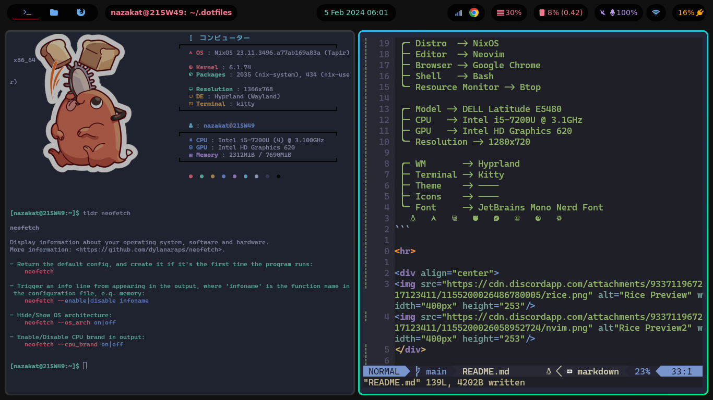

<div align="center">
<h1>
❄️ NixOS dotfiles ❄️
</h1>
</div>
<h2 align="center">NixOS system configuration. Feel free to explore!</h2>

<hr>

```mint
⠀⠀   🌸 Setup / Hyprland 🌸
 -----------------------------------

 ╭─ Distro  -> NixOS
 ├─ Editor  -> Neovim
 ├─ Browser -> Google Chrome
 ├─ Shell   -> Bash
 ╰─ Resource Monitor -> Btop

 ╭─ Model -> DELL Latitude E5480
 ├─ CPU   -> Intel i5-7200U @ 3.1GHz
 ├─ GPU   -> Intel HD Graphics 620
 ╰─ Resolution -> 1280x720

 ╭─ WM       -> Hyprland
 ├─ Terminal -> Kitty
 ├─ Theme    -> ----
 ├─ Icons    -> ----
 ╰─ Font     -> JetBrains Mono Nerd Font 
                        
```

<hr>

<div align="center">

</div>

<hr>

## Setup:

- To update system channel:

```
cd .dotfiles
./Scripts/update-system.sh
```

- To update user channel:

```
cd .dotfiles
./Scripts/update-users.sh
```

- To apply system configs:

```
cd .dotfiles
./Scripts/apply-system.sh
```

- To apply user configs:

```
cd .dotfiles
./Scripts/apply-user.sh
```
