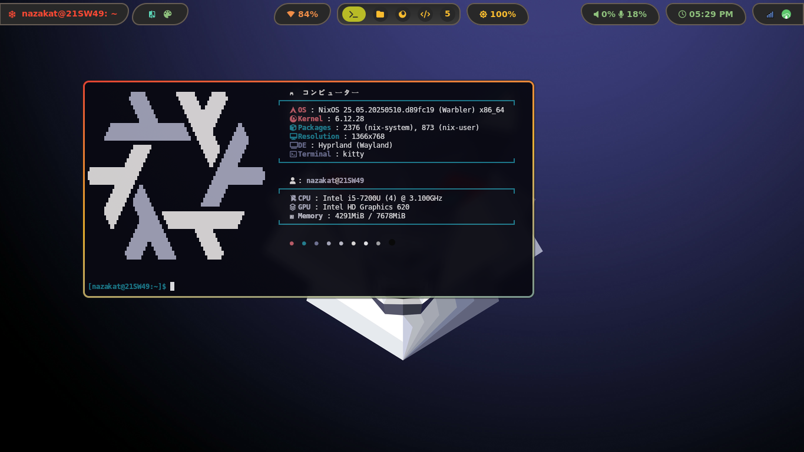
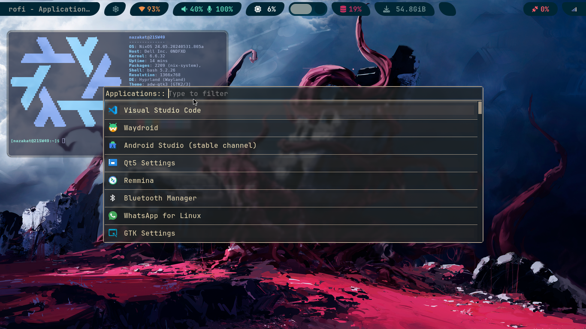
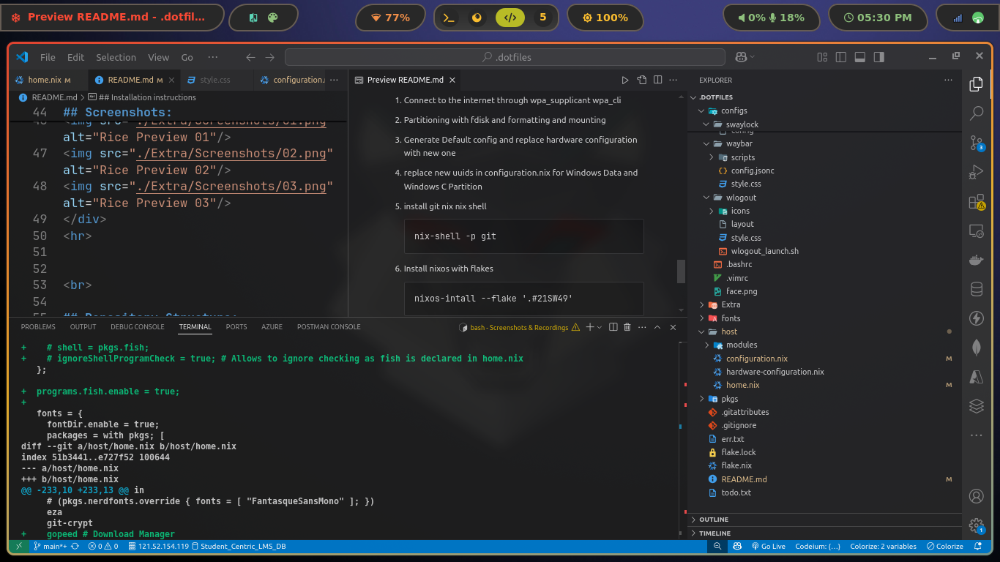

<div align="center">
<h1>
❄️ NixOS dotfiles ❄️
</h1>
<p align="left">
On my main machine I use NixOS as my daily driver Operating System, NixOS is reproducible, immutable, declarative and more.
I love to explore to world of Linux, and with nixos not only I can declare all my settings in files, I can recreate my entire system with just those files again, in other OS, when we install, we need to do every configuration by ourselves, and in case of breaking and bugs, if we reinstall the system, all settings, extensions, themes, are wiped and we need to start from the scratch again, but with nixos now I got everything declared in my files, just need to run this command below and everything is configured back as how it was before the breaking.
</p>

```
nixos-rebuild switch --flake .#
```

<br>
</div>

## My system specifications:

```mint
⠀⠀   🌸 Setup / Hyprland 🌸
 -----------------------------------

 ╭─ Distro  -> NixOS
 ├─ Editor  -> Neovim
 ├─ Browser -> Google Chrome
 ├─ Shell   -> Bash
 ╰─ Resource Monitor -> Btop

 ╭─ Model -> DELL Latitude E5480
 ├─ CPU   -> Intel i5-7200U @ 3.1GHz
 ├─ GPU   -> Intel HD Graphics 620
 ╰─ Resolution -> 1280x720

 ╭─ WM       -> Hyprland
 ├─ Terminal -> Kitty
 ├─ Theme    -> ----
 ├─ Icons    -> ----
 ╰─ Font     -> JetBrains Mono Nerd Font 
                        
```

<br>

## Screenshots:
<div align="center">



</div>
<hr>


<br>

## Repository Structure:

<b>Configs Directory: </b>Contains configs for all programs like, hyprland, kitty, neovim etc.

<b>Extra Directory: </b>Contains non NixOS files useful for me. You can safely remove them.

<b>Host Directory: </b>Contains NixOS system files as well as home manager module.

<b>Pkgs Directory: </b>Contains packages derivations which are not available in nixpkgs right now written in .nix files.


## Setup:

Make sure to change usernames, emails, and any config file you like to.
- To apply the changes you make to your configs:

```
nixos-rebuild switch --flake .#
```

- To update the repositories and sources:

```
nix flake update
```
