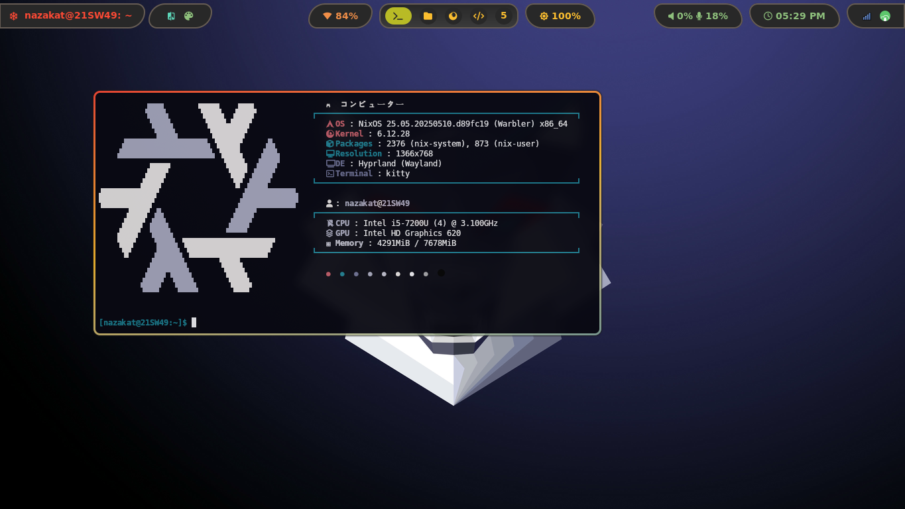
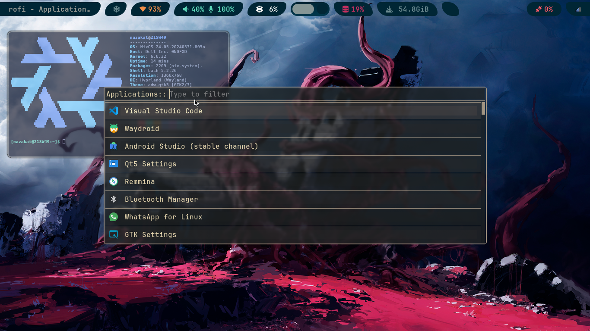
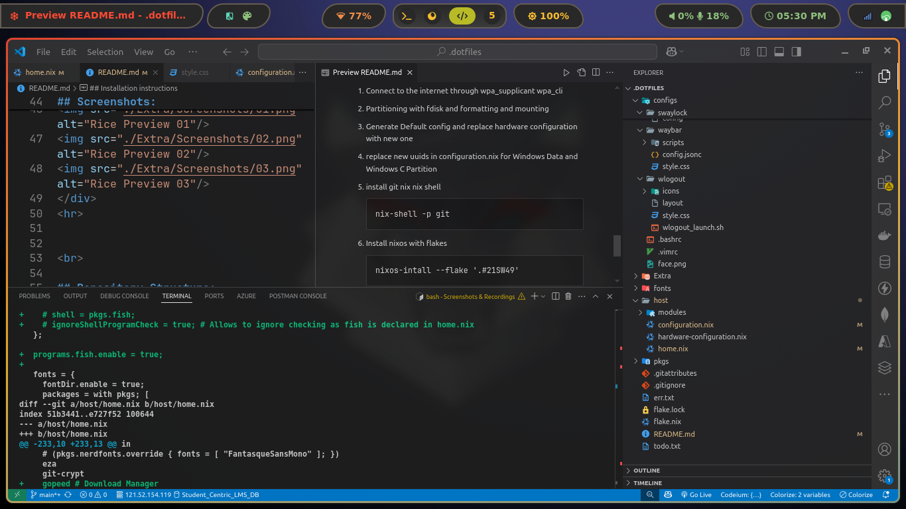

#   NixOS dotfiles 

## ✨ About

On my main machines, I use **NixOS** as my daily driver.

NixOS allows me to define my entire system — from packages to UI — inside configuration files.  
This means:

- No manual setup after reinstall  
- No lost configurations or themes  
- Everything reproducible with a single command  

Unlike traditional operating systems where you configure everything manually again, with NixOS I just run:

```
nixos-rebuild switch --flake .#
```

<br>

## 💻 System Specifications

### 1. 🌸 Dell Latitude E5480
```mint
⠀⠀   🌸 NixOS / Hyprland 🌸
 -----------------------------------

 ╭─ CPU              ->   Intel i5-7200U @ 3.1GHz
 ├─ GPU              ->   Intel HD Graphics 620
 ╰─ Resolution       ->   1280x720

 ╭─ WM               ->   Hyprland
 ├─ Theme            ->   adw-gtk3 [GTK2/3/4]
 ├─ Icons            ->   Gruvbox Plus Dark [GTK2/3/4]
 ├─ Font             ->   MapleMono-NF (12pt) [GTK2/3/4]
 ├─ Cursor           ->   Bibata-Modern-Ice
 ├─ Terminal         ->   Kitty
 ╰─ Font             ->   JetBrains Mono Nerd Font
 
 ╭─ Editor           ->   Neovim + Zed + VSCode
 ├─ Browser          ->   Firefox
 ├─ Shell            ->   Fish
 ╰─ Resource Monitor ->   Btop

                       
```

### 2. 🌸 Mechrevo R14P Series
```mint
⠀⠀   🌸 Setup / Hyprland 🌸
 -----------------------------------

 ╭─ CPU              ->   AMD Ryzen 5 7430U (12) @ 4.39 GHz
 ├─ GPU              ->   AMD Barcelo [Integrated]
 ╰─ Resolution       ->   1920x1080 @ 1.25x in 14", 60 Hz

 ╭─ WM               ->   Hyprland
 ├─ Theme            ->   adw-gtk3 [GTK2/3/4]
 ├─ Icons            ->   Gruvbox Plus Dark [GTK2/3/4]
 ├─ Font             ->   MapleMono-NF (12pt) [GTK2/3/4]
 ├─ Cursor           ->   Bibata-Modern-Ice
 ├─ Terminal         ->   Kitty
 ╰─ Font             ->   JetBrains Mono Nerd Font
 
 ╭─ Editor           ->   Neovim + Zed + VSCode
 ├─ Browser          ->   Firefox
 ├─ Shell            ->   Fish
 ╰─ Resource Monitor ->   Btop

                       
```

## 🖼️ Screenshots:

<div align="center">



</div>
<br>

## 📂 Repository Structure:

```
.
├── configs/                # Program configurations (hyprland, kitty, nvim, etc.)
├── hosts/                  # Host-specific configurations
│   ├── 21SW49/             # DELL Latitude configuration
│   │   ├── configuration.nix
│   │   ├── hardware-configuration.nix
│   │   └── home.nix
│   └── mechrevo/           # Mechrevo configuration
│       ├── configuration.nix
│       ├── hardware-configuration.nix
│       └── home.nix
├── modules/                # Modular NixOS and Home Manager modules
│   ├── home/               # Home Manager modules (hyprland, git, shell, etc.)
│   └── system/             # System-level NixOS modules (network, sound, boot, etc.)
├── pkgs/                   # Custom Nix packages not available in nixpkgs.
├── shells/                 # Development shell environments (Flakes)
├── Extra/                  # Non-NixOS Personal files (screenshots, wallpapers, etc.)
├── flake.nix               # Main flake configuration
└── flake.lock              # Locked dependencies
```

## ⚙️ Setup:

## Installation instructions

1. Connect to the internet through wpa_supplicant wpa_cli

2. Partitioning with fdisk and formatting and mounting

3. Install git with nix shell
   ```
   nix-shell -p git
   ```

4. Clone git repository
   ```
   git clone https://github.com/nazakatumrani/dotfiles.git <path/to/clone/to>
   ```

5. Generate Default config and replace hardware configuration in repo with new one

6. Replace new uuids in mountpoints.nix for Windows Data and Windows C Partition

7. Make sure to update usernames, emails, and any configuration files you want to customize

8. Install nixos with flakes
   ```
   nixos-intall --flake '.#21SW49'
   ```

### Basic Commands

- To apply the changes you make to your configs:

  ```
  nixos-rebuild switch --flake .#
  ```

- To update the repositories and sources:

  ```
  nix flake update
  ```
